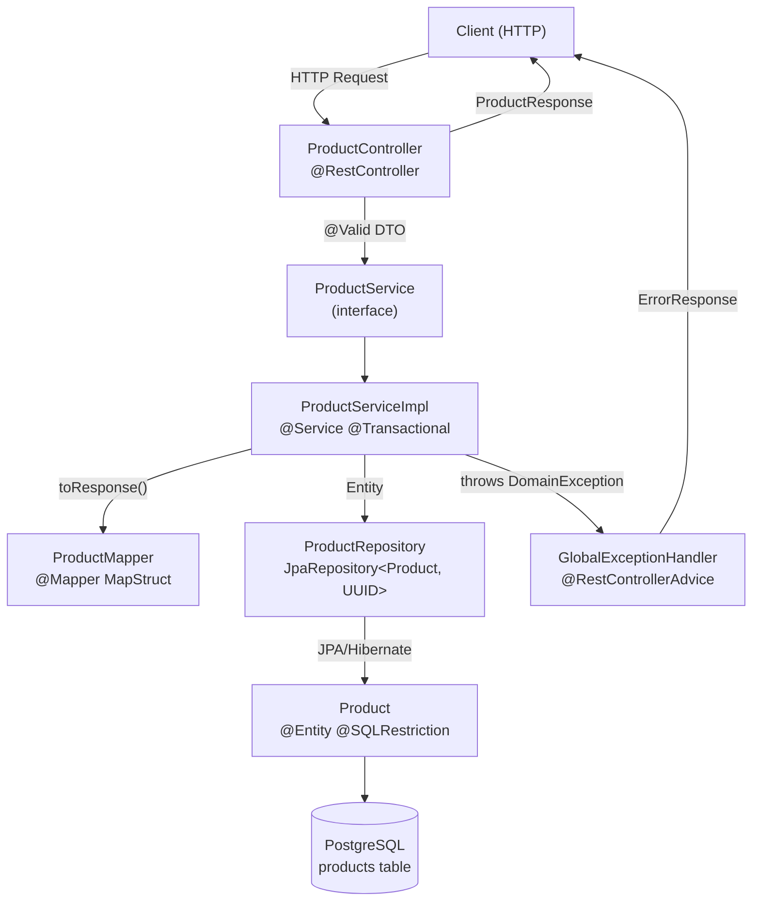

# Design: Gestión de Productos

## Overview

SDD Products API es el sistema de registro (system of record) del catálogo de productos para e-commerce. Expone una API REST bajo `/api/v1/products` con operaciones CRUD completas, ajuste de stock dedicado y soft-delete para auditoría.

El servicio implementa validación estricta de reglas de negocio (SKU inmutable, stock no negativo, SKU único entre activos) y garantiza que los productos eliminados sean invisibles en todas las operaciones estándar sin eliminación física del registro.

---

## Architecture

### Diagrama de capas



### Request lifecycle

```mermaid
sequenceDiagram
    participant C as Client
    participant Ctrl as ProductController
    participant S as ProductServiceImpl
    participant M as ProductMapper
    participant R as ProductRepository
    participant DB as PostgreSQL

    C->>Ctrl: HTTP Request + JSON body
    Ctrl->>Ctrl: Bean Validation (@Valid)
    alt Validation fails
        Ctrl-->>C: 400 ErrorResponse
    end
    Ctrl->>S: service.method(requestDto)
    S->>R: repository.findById(id)
    R->>DB: SELECT WHERE deleted_at IS NULL
    DB-->>R: Product entity
    R-->>S: Optional&lt;Product&gt;
    alt Not found
        S-->>Ctrl: throws ProductNotFoundException
        Ctrl-->>C: 404 ErrorResponse
    end
    S->>S: Business logic + UUID.randomUUID()
    S->>R: repository.save(product)
    R->>DB: INSERT / UPDATE
    S->>M: toResponse(product)
    M-->>S: ProductResponse
    S-->>Ctrl: ProductResponse
    Ctrl-->>C: 200/201/204 JSON
```

---

## Package Structure

```
com.sdd.products/
├── controller/
│   └── ProductController.java
├── service/
│   ├── ProductService.java             # Interface — contrato del caso de uso
│   └── impl/
│       └── ProductServiceImpl.java     # @Service, @Transactional
├── repository/
│   └── ProductRepository.java          # JpaRepository<Product, UUID> — solo derived methods
├── domain/
│   ├── entity/
│   │   └── Product.java                # @Entity, @SQLRestriction("deleted_at IS NULL")
│   └── exception/
│       ├── ProductNotFoundException.java    # HTTP 404
│       ├── SkuAlreadyExistsException.java   # HTTP 409
│       ├── ImmutableSkuException.java       # HTTP 422
│       ├── InsufficientStockException.java  # HTTP 422
│       └── InvalidStockException.java       # HTTP 400
├── dto/
│   ├── request/
│   │   ├── CreateProductRequest.java
│   │   ├── UpdateProductRequest.java
│   │   └── StockAdjustmentRequest.java
│   └── response/
│       ├── ProductResponse.java
│       ├── PaginatedResponse.java
│       └── ErrorResponse.java
├── mapper/
│   └── ProductMapper.java              # @Mapper(componentModel = "spring")
├── config/
│   └── OpenApiConfig.java
└── exception/
    └── GlobalExceptionHandler.java     # @RestControllerAdvice
```

---

## API Contract

### POST /api/v1/products

**Request body:**
```json
{
  "sku": "PROD-001",
  "name": "Teclado Mecánico",
  "description": "Teclado con switches Cherry MX",
  "price": 149.99,
  "stock": 50,
  "category": "PERIPHERALS"
}
```

| HTTP | Condición |
|------|-----------|
| 201  | Producto creado exitosamente |
| 400  | Bean Validation falla o JSON malformado |
| 409  | SKU ya existe entre productos activos |

Response body (201): `ProductResponse`

---

### GET /api/v1/products/{id}

| HTTP | Condición |
|------|-----------|
| 200  | Producto activo encontrado |
| 404  | No existe o está soft-deleted |

Response body (200): `ProductResponse`

---

### GET /api/v1/products

**Query params:**

| Parámetro | Tipo | Default | Descripción |
|-----------|------|---------|-------------|
| page | int | 0 | Página (0-indexed) |
| size | int | 10 | Tamaño de página |
| category | String | — | Filtro por categoría exacta |
| minPrice | BigDecimal | — | Precio mínimo (inclusive) |
| maxPrice | BigDecimal | — | Precio máximo (inclusive) |
| name | String | — | Contiene en name (case-insensitive) |
| sku | String | — | SKU exacto (case-sensitive) |

| HTTP | Condición |
|------|-----------|
| 200  | Lista paginada (puede estar vacía) |
| 400  | Parámetros inválidos |

Response body (200): `PaginatedResponse<ProductResponse>`

---

### PUT /api/v1/products/{id}

**Request body** (todos los campos opcionales, `sku` no se acepta):
```json
{
  "name": "Teclado Mecánico Pro",
  "description": "Versión actualizada",
  "price": 179.99,
  "stock": 30,
  "category": "PERIPHERALS"
}
```

| HTTP | Condición |
|------|-----------|
| 200  | Producto actualizado exitosamente |
| 400  | Bean Validation falla o JSON malformado |
| 404  | No existe o está soft-deleted |
| 422  | El body incluye el campo `sku` (inmutable) |

Response body (200): `ProductResponse`

---

### DELETE /api/v1/products/{id}

| HTTP | Condición |
|------|-----------|
| 204  | Soft-delete aplicado (sin body) |
| 404  | No existe o ya está soft-deleted |

---

### PATCH /api/v1/products/{id}/stock

**Request body:**
```json
{ "delta": -5 }
```

| HTTP | Condición |
|------|-----------|
| 200  | Stock ajustado exitosamente |
| 400  | JSON malformado |
| 404  | No existe o está soft-deleted |
| 422  | `currentStock + delta` resultaría en valor menor a 0 |

Response body (200): `ProductResponse`

---

## Data Models

### Entity: Product

```java
@Entity
@Table(name = "products")
@SQLRestriction("deleted_at IS NULL")
public class Product {

    @Id
    @Column(nullable = false, updatable = false)
    private UUID id;                    // generado en Service con UUID.randomUUID()

    @Column(nullable = false, unique = true, length = 50)
    private String sku;

    @Column(nullable = false, length = 100)
    private String name;

    @Column(columnDefinition = "TEXT")
    private String description;

    @Column(nullable = false, precision = 19, scale = 4)
    private BigDecimal price;

    @Column(nullable = false)
    private int stock;

    @Enumerated(EnumType.STRING)
    @Column(nullable = false, length = 20)
    private Category category;

    @Column(nullable = false, updatable = false)
    private OffsetDateTime createdAt;

    @Column(nullable = false)
    private OffsetDateTime updatedAt;

    @Column(nullable = true)
    private OffsetDateTime deletedAt;   // null = activo, timestamp = eliminado

    @PrePersist
    void onPersist() {
        createdAt = OffsetDateTime.now();
        updatedAt = OffsetDateTime.now();
    }

    @PreUpdate
    void onUpdate() {
        updatedAt = OffsetDateTime.now();
    }
}
```

### Enum: Category

```java
public enum Category {
    ELECTRONICS,
    PERIPHERALS,
    SOFTWARE,
    ACCESSORIES
}
```

### DTO: CreateProductRequest

```java
public class CreateProductRequest {

    @NotBlank
    @Pattern(regexp = "^[A-Z0-9-]+$")
    @Size(max = 50)
    private String sku;

    @NotBlank
    @Size(max = 100)
    private String name;

    private String description;

    @NotNull
    @Positive
    private BigDecimal price;

    @Min(0)
    private int stock;          // default 0 cuando ausente

    @NotNull
    private Category category;
}
```

### DTO: UpdateProductRequest

```java
// No incluye campo sku — si llega en el JSON, el Service lanza ImmutableSkuException
public class UpdateProductRequest {

    @Size(max = 100)
    private String name;        // null = no actualizar

    private String description;

    @Positive
    private BigDecimal price;   // null = no actualizar

    @Min(0)
    private Integer stock;      // null = no actualizar

    private Category category;  // null = no actualizar
}
```

### DTO: StockAdjustmentRequest

```java
public class StockAdjustmentRequest {

    // Sin restricción de rango — puede ser positivo o negativo
    // La validación de stock resultante (>= 0) se realiza en Service
    @NotNull
    private Integer delta;
}
```

### DTO: ProductResponse

```java
public class ProductResponse {
    private UUID id;
    private String sku;
    private String name;
    private String description;
    private BigDecimal price;
    private int stock;
    private Category category;
    private String createdAt;   // ISO 8601 OffsetDateTime serializado como String
    private String updatedAt;   // ISO 8601 OffsetDateTime serializado como String
}
```

### DTO: PaginatedResponse\<T\>

```java
public class PaginatedResponse<T> {
    private List<T> data;
    private int page;
    private int pageSize;
    private long total;
}
```

### DTO: ErrorResponse

```java
public class ErrorResponse {
    private String error;           // código de error (e.g. "PRODUCT_NOT_FOUND")
    private String message;         // descripción legible
    private List<String> fields;    // campos inválidos (Bean Validation), vacío si no aplica
}
```

---

## Database Schema

```sql
-- V1__create_products_table.sql
CREATE TABLE products (
    id          UUID            NOT NULL,
    sku         VARCHAR(50)     NOT NULL,
    name        VARCHAR(100)    NOT NULL,
    description TEXT,
    price       NUMERIC(19, 4)  NOT NULL CHECK (price > 0),
    stock       INTEGER         NOT NULL DEFAULT 0 CHECK (stock >= 0),
    category    VARCHAR(20)     NOT NULL,
    created_at  TIMESTAMPTZ     NOT NULL,
    updated_at  TIMESTAMPTZ     NOT NULL,
    deleted_at  TIMESTAMPTZ,

    CONSTRAINT pk_products  PRIMARY KEY (id),
    CONSTRAINT uq_products_sku UNIQUE (sku)
);

CREATE INDEX idx_products_sku        ON products (sku);
CREATE INDEX idx_products_category   ON products (category);
CREATE INDEX idx_products_deleted_at ON products (deleted_at);
CREATE INDEX idx_products_created_at ON products (created_at DESC);
```

**Notas:**
- `id UUID` — generado en Service, sin `SERIAL` ni `GENERATED`
- `deleted_at TIMESTAMPTZ` nullable — `null` = activo, timestamp = eliminado. Sin columna `active`
- `NUMERIC(19,4)` para `price` — preserva precisión monetaria sin pérdida de punto flotante
- Índice en `deleted_at` para que `@SQLRestriction("deleted_at IS NULL")` sea eficiente

---

## Correctness Properties

*A property is a characteristic or behavior that should hold true across all valid executions of a system — essentially, a formal statement about what the system should do. Properties serve as the bridge between human-readable specifications and machine-verifiable correctness guarantees.*

### Property 1: Creación exitosa — estado inicial correcto

*For any* `CreateProductRequest` válido, el producto creado debe tener: un `id` UUID no nulo, `sku`/`name`/`price`/`category` iguales al request, `deletedAt = null`, y `createdAt`/`updatedAt` no nulos e iguales entre sí.

**Validates: Requirements REQ-001.1, REQ-001.2, REQ-001.3, REQ-001.4**

---

### Property 2: Validación de request — campos inválidos rechazados

*For any* request con al menos un campo que viole Bean Validation (name en blanco, price menor o igual a 0, sku con caracteres inválidos, stock menor a 0, category inválida), el sistema debe retornar HTTP 400 con un `ErrorResponse` que identifique el campo inválido.

**Validates: Requirements REQ-001.7, REQ-001.8, REQ-001.9, REQ-001.10, REQ-001.11, REQ-001.12**

---

### Property 3: SKU duplicado entre activos → 409

*For any* SKU que ya pertenezca a un producto activo, intentar crear un segundo producto con ese mismo SKU debe retornar HTTP 409.

**Validates: Requirements REQ-001.6**

---

### Property 4: Consulta por ID — round-trip crear y consultar

*For any* producto creado exitosamente, consultarlo por su `id` debe retornar HTTP 200 con un `ProductResponse` cuyos campos son equivalentes a los del producto creado.

**Validates: Requirements REQ-002.1**

---

### Property 5: Producto no visible → 404

*For any* UUID que no corresponda a un producto activo (inexistente o soft-deleted), cualquier operación estándar (GET, PUT, PATCH, DELETE) debe retornar HTTP 404.

**Validates: Requirements REQ-002.2, REQ-002.3, REQ-004.4, REQ-005.3, REQ-006.4**

---

### Property 6: Listado excluye soft-deleted

*For any* estado del catálogo con productos activos y soft-deleted, `GET /api/v1/products` debe retornar únicamente productos con `deletedAt = null`. Ningún producto soft-deleted debe aparecer en ninguna página del listado.

**Validates: Requirements REQ-003.1**

---

### Property 7: Filtro por category

*For any* valor de `Category` usado como filtro, todos los productos retornados deben tener exactamente esa `category`.

**Validates: Requirements REQ-003.3**

---

### Property 8: Filtro por rango de precio

*For any* combinación de `minPrice` y/o `maxPrice`, todos los productos retornados deben satisfacer `price >= minPrice` (si se provee) y `price <= maxPrice` (si se provee).

**Validates: Requirements REQ-003.4, REQ-003.5**

---

### Property 9: Filtro por name (contains, case-insensitive)

*For any* string de búsqueda `name`, todos los productos retornados deben tener un `name` que contenga ese string ignorando mayúsculas/minúsculas.

**Validates: Requirements REQ-003.6**

---

### Property 10: Filtro por SKU (exact match)

*For any* valor de `sku` usado como filtro, todos los productos retornados deben tener exactamente ese `sku` (case-sensitive).

**Validates: Requirements REQ-003.7**

---

### Property 11: Actualización exitosa — campos actualizados y updatedAt renovado

*For any* producto activo y `UpdateProductRequest` válido, después de un PUT exitoso: los campos no nulos del request deben reflejarse en el `ProductResponse`, y `updatedAt` debe ser mayor o igual al `updatedAt` previo.

**Validates: Requirements REQ-004.1, REQ-004.2**

---

### Property 12: SKU inmutable — PUT con campo sku → 422

*For any* request de actualización que incluya el campo `sku` en el body, el sistema debe retornar HTTP 422 sin modificar el producto.

**Validates: Requirements REQ-004.3**

---

### Property 13: Soft-delete — deletedAt asignado e invisibilidad posterior

*For any* producto activo, después de un DELETE exitoso: el registro físico debe permanecer en BD con `deletedAt != null`, y cualquier operación estándar posterior sobre ese id debe retornar HTTP 404.

**Validates: Requirements REQ-005.1, REQ-005.2**

---

### Property 14: Ajuste de stock válido — newStock = currentStock + delta

*For any* producto activo con `currentStock >= 0` y cualquier `delta` tal que `currentStock + delta >= 0`, después de un PATCH exitoso el stock del producto debe ser exactamente `currentStock + delta`.

**Validates: Requirements REQ-006.1, REQ-006.2**

---

### Property 15: Stock no negativo — delta inválido rechazado sin efecto

*For any* producto activo con `currentStock = C` y cualquier `delta` tal que `C + delta < 0`, el sistema debe retornar HTTP 422 y el stock del producto debe permanecer en `C`.

**Validates: Requirements REQ-006.3**

---

### Property 16: JSON round-trip — serializar y deserializar ProductResponse

*For any* `ProductResponse` válido, serializar a JSON y deserializar debe producir un objeto equivalente, preservando la precisión de `BigDecimal` en `price` y el formato ISO 8601 en `createdAt`/`updatedAt`.

**Validates: Requirements REQ-007.1, REQ-007.2, REQ-007.4**

---

## Error Handling

### Mapeo de excepciones → HTTP

| Excepción | HTTP | Código de error | Descripción |
|-----------|------|-----------------|-------------|
| `ProductNotFoundException` | 404 | `PRODUCT_NOT_FOUND` | No existe producto activo con ese id |
| `SkuAlreadyExistsException` | 409 | `SKU_ALREADY_EXISTS` | SKU duplicado entre productos activos |
| `ImmutableSkuException` | 422 | `IMMUTABLE_SKU` | Intento de modificar el SKU |
| `InsufficientStockException` | 422 | `INSUFFICIENT_STOCK` | Ajuste resultaría en stock menor a 0 |
| `InvalidStockException` | 400 | `INVALID_STOCK` | Stock inválido en request |
| `MethodArgumentNotValidException` | 400 | `VALIDATION_ERROR` | Bean Validation falla — `fields` contiene los campos inválidos |
| `HttpMessageNotReadableException` | 400 | `MALFORMED_JSON` | JSON no parseable |
| `Exception` (fallback) | 500 | `INTERNAL_ERROR` | Error inesperado |

**Reglas:**
- `GlobalExceptionHandler` es el único lugar donde se construye `ErrorResponse`
- Las excepciones de dominio extienden `RuntimeException` (unchecked)
- Nunca retornar `null` — usar `Optional<T>` o lanzar excepción de dominio
- El campo `fields` es lista vacía `[]` cuando no aplica (no `null`)

---

## Testing Strategy

### Enfoque dual: unit tests + property-based tests

Ambos tipos son complementarios y obligatorios. Los unit tests verifican ejemplos concretos y casos borde; los property tests verifican propiedades universales sobre rangos amplios de inputs.

### Unit Tests

**`ProductControllerTest`** — `@WebMvcTest` + `MockMvc`
- Verifica serialización/deserialización HTTP correcta
- Verifica que `@Valid` activa Bean Validation
- Verifica códigos HTTP y estructura de `ErrorResponse`
- Patrón de nombres: `should_return201_when_validCreateRequest`

**`ProductServiceImplTest`** — `@ExtendWith(MockitoExtension)`
- Verifica lógica de negocio con repositorio mockeado
- Verifica que excepciones de dominio se lanzan en las condiciones correctas
- Verifica que `UUID.randomUUID()` se usa para el id (no delegado a BD)
- Patrón de nombres: `should_throwSkuAlreadyExistsException_when_skuIsDuplicated`

**`ProductRepositoryTest`** — `@DataJpaTest`
- Verifica que `@SQLRestriction` excluye soft-deleted en todas las queries
- Verifica derived methods: `findBySku`, `existsBySku`, `findByNameContainingIgnoreCase`
- Verifica que el registro físico permanece tras soft-delete (REQ-005.2)

### Property-Based Tests

**`ProductPropertyTest`** — jqwik 1.8.x con `jqwik-spring`

Cada propiedad del diseño se implementa como un único `@Property(tries = 100)`. Los generadores (`@Provide`) producen instancias aleatorias de los DTOs y entidades.

```java
// Feature: product, Property 1: creación exitosa — estado inicial correcto
@Property(tries = 100)
void should_haveCorrectInitialState_when_productIsCreated(
    @ForAll("validCreateRequests") CreateProductRequest request) { ... }

// Feature: product, Property 2: validación de request — campos inválidos rechazados
@Property(tries = 100)
void should_return400_when_requestHasInvalidFields(
    @ForAll("invalidCreateRequests") CreateProductRequest request) { ... }

// Feature: product, Property 3: SKU duplicado → 409
@Property(tries = 100)
void should_return409_when_skuAlreadyExists(
    @ForAll("validSkus") String sku) { ... }

// Feature: product, Property 4: round-trip crear y consultar
@Property(tries = 100)
void should_returnEquivalentProduct_when_queriedAfterCreation(
    @ForAll("validCreateRequests") CreateProductRequest request) { ... }

// Feature: product, Property 5: producto no visible → 404
@Property(tries = 100)
void should_return404_when_productNotVisible(
    @ForAll UUID randomId) { ... }

// Feature: product, Property 6: listado excluye soft-deleted
@Property(tries = 100)
void should_excludeSoftDeleted_when_listing(
    @ForAll("mixedProductSets") List<Product> products) { ... }

// Feature: product, Property 7: filtro por category
@Property(tries = 100)
void should_returnOnlyMatchingCategory_when_categoryFilterApplied(
    @ForAll Category category) { ... }

// Feature: product, Property 8: filtro por rango de precio
@Property(tries = 100)
void should_returnProductsInPriceRange_when_priceFilterApplied(
    @ForAll("positiveBigDecimals") BigDecimal min,
    @ForAll("positiveBigDecimals") BigDecimal max) { ... }

// Feature: product, Property 9: filtro por name
@Property(tries = 100)
void should_returnProductsContainingName_when_nameFilterApplied(
    @ForAll @AlphaChars String nameFragment) { ... }

// Feature: product, Property 10: filtro por SKU exact match
@Property(tries = 100)
void should_returnExactSkuMatch_when_skuFilterApplied(
    @ForAll("validSkus") String sku) { ... }

// Feature: product, Property 11: actualización exitosa
@Property(tries = 100)
void should_reflectChangesAndUpdateTimestamp_when_updateSucceeds(
    @ForAll("validUpdateRequests") UpdateProductRequest request) { ... }

// Feature: product, Property 12: SKU inmutable
@Property(tries = 100)
void should_return422_when_putIncludesSku(
    @ForAll("validSkus") String sku) { ... }

// Feature: product, Property 13: soft-delete e invisibilidad
@Property(tries = 100)
void should_beInvisibleAfterDelete_when_softDeleteApplied(
    @ForAll("validCreateRequests") CreateProductRequest request) { ... }

// Feature: product, Property 14: ajuste de stock válido
@Property(tries = 100)
void should_applyDeltaCorrectly_when_stockAdjustmentIsValid(
    @ForAll @IntRange(min = 0, max = 1000) int currentStock,
    @ForAll @IntRange(min = 0, max = 1000) int delta) { ... }

// Feature: product, Property 15: stock no negativo
@Property(tries = 100)
void should_return422AndLeaveStockUnchanged_when_deltaWouldResultInNegativeStock(
    @ForAll @IntRange(min = 0, max = 100) int currentStock,
    @ForAll @IntRange(min = 1, max = 200) int negativeDelta) { ... }

// Feature: product, Property 16: JSON round-trip
@Property(tries = 100)
void should_preserveAllFields_when_jsonRoundTrip(
    @ForAll("validProductResponses") ProductResponse response) { ... }
```

### Cobertura

- Mínimo **80%** de líneas y ramas verificado por JaCoCo en cada build Maven
- Los property tests con `tries = 100` cubren el espacio de inputs de forma aleatoria
- Los unit tests cubren casos borde específicos no alcanzables por generadores aleatorios

---

## Decision Log

| ID | Decisión | Razón |
|----|----------|-------|
| D1 | Soft delete | Auditoría y trazabilidad — los datos se conservan para análisis histórico |
| D2 | DTOs separados de entidades | No exponer la entidad JPA en la API — desacopla el contrato HTTP del modelo de persistencia |
| D3 | MapStruct | Mapeo compile-time sin reflection — errores detectados en compilación, no en runtime |
| D4 | Flyway | Control de versiones del esquema DB — reproducible en cualquier entorno |
| D5 | Interface en Service | DIP: Controller depende de abstracción, no de implementación concreta |
| D6 | UUID en lugar de BIGSERIAL | Evita exposición de secuencias internas, mejor para APIs distribuidas y sin acoplamiento a BD |
| D7 | `deleted_at` en lugar de `active BOOLEAN` | Permite auditoría temporal — se sabe exactamente cuándo fue eliminado, no solo si lo está |
| D8 | `@SQLRestriction` de Hibernate 6 | Filtro automático a nivel de entidad — sin `@Query` JPQL/SQL nativo, aplica en todas las operaciones estándar sin código adicional |
| D9 | `category` como enum Java | Validación en compile-time, valores controlados, serialización segura con `EnumType.STRING` |
