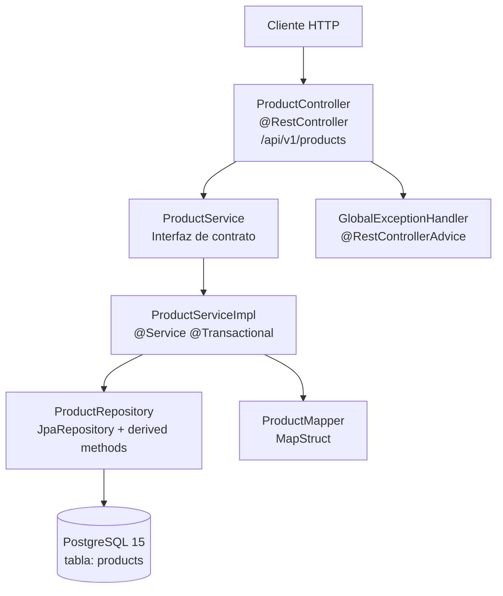

# SDD Products API — Visión General del Sistema

## Descripción del Producto

SDD Products API es un servicio REST de gestión de catálogo de productos para e-commerce. Es el **system of record** del catálogo: todos los sistemas que necesiten leer o modificar productos deben hacerlo a través de esta API.

Expone operaciones CRUD sobre productos con validación estricta de reglas de negocio, soporte de soft-delete para auditoría y control de inventario.

**URL base:** `/api/v1/products`
**Documentación interactiva:** `/swagger-ui.html`
**Especificación OpenAPI 3:** `/v3/api-docs`

---

## Usuarios del Sistema

| Usuario | Rol |
|---|---|
| **Operator** | Usuario de negocio que gestiona el catálogo: crear, actualizar, eliminar productos y ajustar stock |
| **External System** | Sistema externo que consume la API REST para leer datos del catálogo o integrarse con él |

---

## Arquitectura en Capas



**Reglas de la arquitectura:**
- El Controller solo conoce la interfaz `ProductService`, nunca la implementación ni el Repository
- El Service solo conoce el Repository y las entidades de dominio
- Los DTOs nunca cruzan la frontera de la capa Service hacia abajo
- Las excepciones de dominio se lanzan desde Service y se capturan en `GlobalExceptionHandler`

---

## Alcance del Servicio

**Incluye:**
- CRUD de productos (crear, consultar por ID, listar con paginación y filtros, actualizar, eliminar)
- Ajuste de stock como operación dedicada (`PATCH /api/v1/products/{id}/stock`)
- Validación de reglas de negocio antes de persistir
- Documentación OpenAPI accesible en `/swagger-ui.html`

**No incluye:**
- Autenticación ni autorización
- Gestión de categorías como entidad separada, imágenes o variantes de producto
- Historial de cambios de precio o stock
- Notificaciones o eventos de dominio

---

## Reglas de Negocio Críticas

Estas reglas son invariantes del dominio y se aplican en toda la implementación:

| # | Regla | Comportamiento ante violación |
|---|---|---|
| 1 | **SKU inmutable** | El SKU no puede modificarse tras la creación | HTTP 422 |
| 2 | **Stock no negativo** | El stock nunca puede ser menor a cero | HTTP 422 |
| 3 | **Soft-delete obligatorio** | Los productos nunca se eliminan físicamente | `deletedAt` asignado |
| 4 | **Invisibilidad post-delete** | Un producto soft-deleted es inexistente en operaciones estándar | HTTP 404 |
| 5 | **Campos obligatorios** | `name`, `sku` y `price` son requeridos en creación | HTTP 400 |
| 6 | **SKU único** | No pueden existir dos productos activos con el mismo SKU | HTTP 409 |

### Ejemplos de comportamiento esperado

**SKU inmutable:**
```
PUT /api/v1/products/{id}
Body: { "sku": "NUEVO-SKU" }
→ HTTP 422 { "error": "IMMUTABLE_SKU", "message": "SKU cannot be modified after creation" }
```

**Stock no negativo:**
```
PATCH /api/v1/products/{id}/stock
Body: { "delta": -999 }  (stock actual: 10)
→ HTTP 422 { "error": "INSUFFICIENT_STOCK", "message": "Insufficient stock. Current: 10, requested delta: -999" }
```

**Soft-delete e invisibilidad:**
```
DELETE /api/v1/products/{id}  → HTTP 204 (deletedAt asignado, registro físico preservado)
GET    /api/v1/products/{id}  → HTTP 404 (tratado como inexistente)
```

---

## Decisiones de Diseño

| ID | Decisión | Justificación |
|---|---|---|
| D1 | IDs como UUID generados en Service | Independencia de la BD, portabilidad entre entornos |
| D2 | Soft-delete via `deletedAt` nullable | Auditoría completa sin pérdida de datos |
| D3 | `@SQLRestriction` en entidad | Filtro automático en todas las queries sin código adicional |
| D4 | DTOs separados de entidades JPA | Desacoplamiento entre API contract y modelo de persistencia |
| D5 | `BigDecimal` para precios | Precisión arbitraria, sin errores de punto flotante |
| D6 | `OffsetDateTime` para fechas | Soporte de zona horaria, serialización ISO 8601 |
| D7 | Solo derived methods en Repository | Sin JPQL/SQL nativo, máxima legibilidad y type-safety |
| D8 | GlobalExceptionHandler centralizado | Un único lugar para traducir excepciones a `ErrorResponse` |
| D9 | MapStruct para mapeo DTO↔Entity | Mapeo en tiempo de compilación, sin reflexión en runtime |
